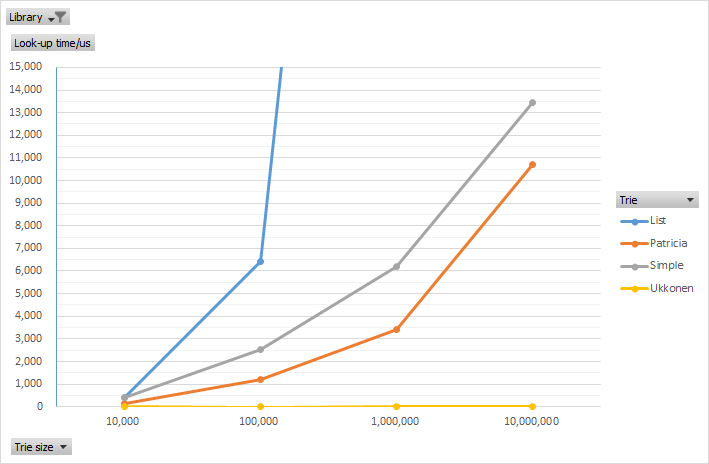
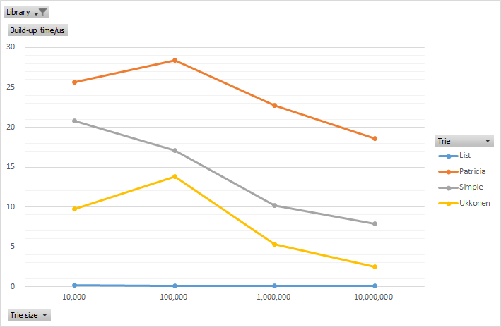
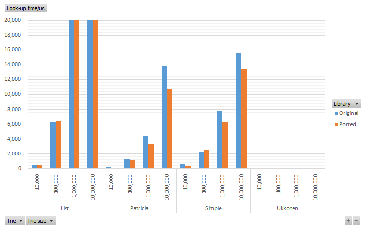
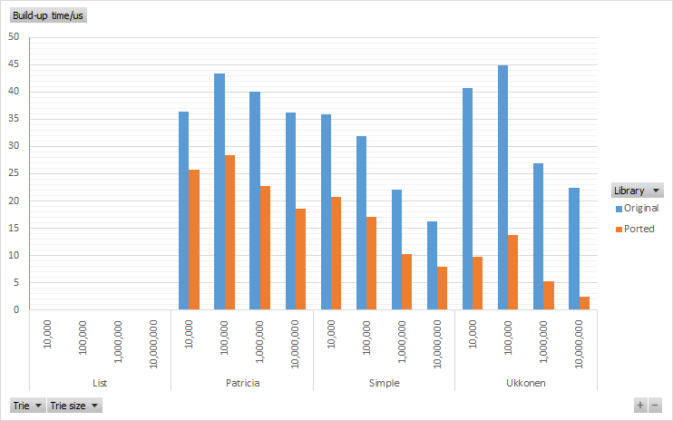

[](https://www.nuget.org/packages/CXuesong.Ported.TrieNet)


This is a .NET Core 3.1 / .NET 6.0 ported version of [`gmamaladze/trienet`](https://github.com/gmamaladze/trienet). Please refer to the README.md file in this original repository for its background, appliances, motivation, and perhaps find some updates there :-)

This library provides efficient prefix / infix (aka. substring) search with various data structures. To install the NuGet package, use the following command

```powershell
#  Package Management Console
Install-Package CXuesong.Ported.TrieNet
#  .NET CLI
dotnet add package CXuesong.Ported.TrieNet
```

The library provides the following interface to expose the most basic & common functionality of various tries. Note that the actual "Retrieve" behavior (prefix / infix search) is implementation-dependent.

```csharp
namespace Gma.DataStructures.StringSearch;

public interface IReadOnlyTrie<out TValue>
{
    IEnumerable<TValue> Retrieve(ReadOnlySpan<char> query);
    IEnumerable<TValue> Retrieve(ReadOnlyMemory<char> query);
    IEnumerable<TValue> Retrieve(string query);
}

public interface ITrie<TValue> : IReadOnlyTrie<TValue>
{
    void Add(ReadOnlyMemory<char> key, TValue value);
    void Add(string key, TValue value);
}
```

Compared with the original edition, this ported package introduced `Memory` / `Span`-based API that can be helpful if you do not want to creating a lot of `string`s when querying for a specific word / prefix.

# Basic usage

Copied from the README.md in the original repo:

```csharp
using Gma.DataStructures.StringSearch;

var trie = new UkkonenTrie<int>(3);
//var trie = new SuffixTrie<int>(3);

trie.Add("hello", 1);
trie.Add("world", 2);
trie.Add("hell", 3);

var result = trie.Retrieve("hel");
```

## Implementations

Class|Description  
-----|-------------
`Trie` | the simple trie, allows only prefix search, like `.Where(s => s.StartsWith(searchString))`
`SuffixTrie` | allows also infix search, like `.Where(s => s.Contains(searchString))`
`PatriciaTrie` | compressed trie, more compact, a bit more efficient during look-up, but a quite slower durig build-up.
`SuffixPatriciaTrie` | the same as PatriciaTrie, also enabling infix search.
`ParallelTrie` | very primitively implemented parallel data structure which allows adding data and retriving results from different threads simultaneusly.

## Performance

Similar to the performance test given by the README.md in the original repo, please execute the `PerformanceComparisonTests` in the unit test project for the results below.

In addition to the performance gain thanks to the algorithms, the adoption of `ReadOnlyMemory` and `ReadOnlySpan` instead of `string` concatenations also slightly reduces the trie build-up time and look-up time.

| Library  | Trie     | Trie size | Average build-up time / μs [1] | Average look-up time / μs [1] |
| -------- | -------- | --------- | ------------------------------ | ----------------------------- |
| Ported   | List     | 10000     | 0.00015799                     | 0.4258261                     |
| Ported   | List     | 100000    | 0.000117093                    | 6.41492                       |
| Ported   | List     | 1000000   | 8.59167E-05                    | 62.4145353                    |
| Ported   | List     | 10000000  | 7.39596E-05                    | 613.7549361                   |
| Ported   | Simple   | 10000     | 0.02081593                     | 0.3986137                     |
| Ported   | Simple   | 100000    | 0.01706555                     | 2.5130111                     |
| Ported   | Simple   | 1000000   | 0.010196724                    | 6.2127804                     |
| Ported   | Simple   | 10000000  | 0.007859363                    | 13.4384304                    |
| Ported   | Patricia | 10000     | 0.02568545                     | 0.1480369                     |
| Ported   | Patricia | 100000    | 0.028423288                    | 1.2105836                     |
| Ported   | Patricia | 1000000   | 0.022704366                    | 3.3937264                     |
| Ported   | Patricia | 10000000  | 0.018559345                    | 10.695376                     |
| Ported   | Ukkonen  | 10000     | 0.00977199                     | 0.003659                      |
| Ported   | Ukkonen  | 100000    | 0.013782538                    | 0.0020912                     |
| Ported   | Ukkonen  | 1000000   | 0.005320595                    | 0.008634                      |
| Ported   | Ukkonen  | 10000000  | 0.002497147                    | 0.0034146                     |
| Original | List     | 10000     | 7.15E-05                       | 0.5377777                     |
| Original | List     | 100000    | 3.35E-05                       | 6.2633735                     |
| Original | List     | 1000000   | 2.55E-05                       | 62.8162105                    |
| Original | List     | 10000000  | 3.47E-05                       | 680.9147302                   |
| Original | Simple   | 10000     | 0.03590873                     | 0.5557195                     |
| Original | Simple   | 100000    | 0.031803895                    | 2.2783007                     |
| Original | Simple   | 1000000   | 0.022034113                    | 7.7646562                     |
| Original | Simple   | 10000000  | 0.016253334                    | 15.6207485                    |
| Original | Patricia | 10000     | 0.03638605                     | 0.1526041                     |
| Original | Patricia | 100000    | 0.043397079                    | 1.2938307                     |
| Original | Patricia | 1000000   | 0.039961653                    | 4.4068422                     |
| Original | Patricia | 10000000  | 0.036163905                    | 13.8353916                    |
| Original | Ukkonen  | 10000     | 0.04070035                     | 0.0026287                     |
| Original | Ukkonen  | 100000    | 0.044814738                    | 0.0023707                     |
| Original | Ukkonen  | 1000000   | 0.026926235                    | 0.0037741                     |
| Original | Ukkonen  | 10000000  | 0.022351132                    | 0.0034634                     |

[1] Average operation time over each trie item.

Here is the look-up time and build-up time for each kind of trie in the ported library.





Here is the look-up time and build-time for ported (this repo) v.s. original library.





## Demo application

This demo application is from the original repository. The only change in this repo is the demo performs case-insensitive search.

> The app demonstrates indexing of large text files and look-up inside them. I have experimented with huge texts containing millions of words. Indexing took usually only several seconds and the look-up delay was still unnoticable for the user.


